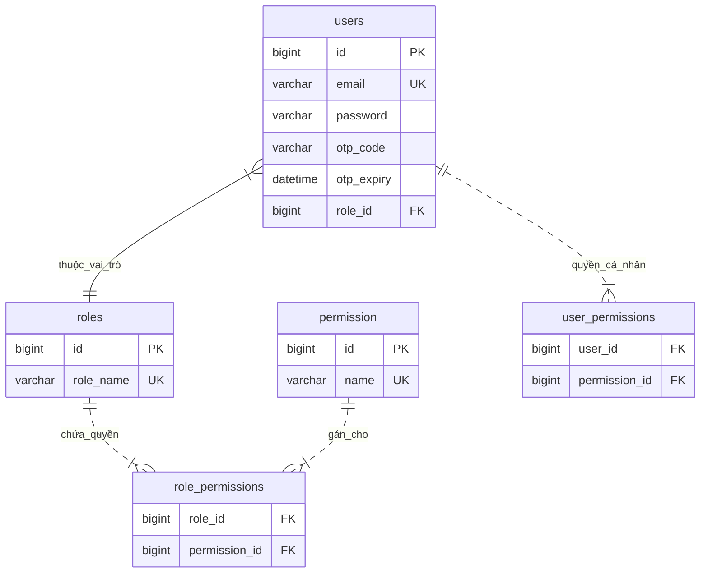
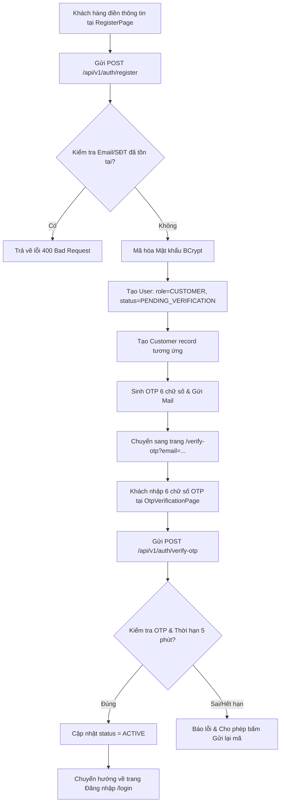
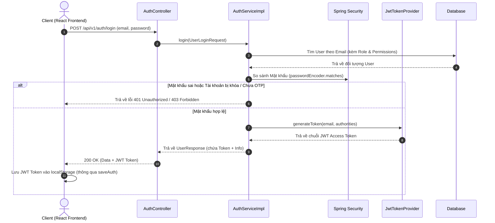

# Hướng dẫn chi tiết: Xác thực & Đăng nhập (User Authentication & JWT)

## 1. Tổng quan (Overview)
Module Xác thực & Phân quyền (Authentication & Authorization) đóng vai trò là "lớp lá chắn" bảo mật cho toàn bộ hệ thống Khách sạn. Hệ thống sử dụng cơ chế **Stateless Authentication** dựa trên **JWT (JSON Web Token)** kết hợp với **Spring Security**.

### Các thành phần chính trong hệ thống:
*   **Frontend Pages & Components**:
    *   [LoginPage.jsx](file:///d:/FPT/Ki5/SWP391/Hotel_Management_System/SWP391_Project/frontend/src/pages/LoginPage.jsx): Màn hình đăng nhập tài khoản.
    *   [RegisterPage.jsx](file:///d:/FPT/Ki5/SWP391/Hotel_Management_System/SWP391_Project/frontend/src/pages/RegisterPage.jsx): Màn hình đăng ký tài khoản khách hàng.
    *   [OtpVerificationPage.jsx](file:///d:/FPT/Ki5/SWP391/Hotel_Management_System/SWP391_Project/frontend/src/pages/OtpVerificationPage.jsx): Màn hình nhập mã OTP kích hoạt tài khoản.
    *   [ForgotPasswordPage.jsx](file:///d:/FPT/Ki5/SWP391/Hotel_Management_System/SWP391_Project/frontend/src/pages/ForgotPasswordPage.jsx): Màn hình yêu cầu quên mật khẩu.
    *   [ResetPasswordPage.jsx](file:///d:/FPT/Ki5/SWP391/Hotel_Management_System/SWP391_Project/frontend/src/pages/ResetPasswordPage.jsx): Màn hình đặt lại mật khẩu mới.
    *   [authService.js](file:///d:/FPT/Ki5/SWP391/Hotel_Management_System/SWP391_Project/frontend/src/services/authService.js): Service quản lý các hàm gọi API Auth từ client.
    *   [AuthContext.jsx](file:///d:/FPT/Ki5/SWP391/Hotel_Management_System/SWP391_Project/frontend/src/context/AuthContext.jsx): Context quản lý trạng thái đăng nhập và các helper kiểm tra quyền trên UI.
    *   [api.js](file:///d:/FPT/Ki5/SWP391/Hotel_Management_System/SWP391_Project/frontend/src/services/api.js): Wrapper tự động đính kèm JWT Token vào Header của các HTTP Request.
*   **Backend Controller & Services**:
    *   [AuthController.java](file:///d:/FPT/Ki5/SWP391/Hotel_Management_System/SWP391_Project/src/main/java/com/hms/controller/auth/AuthController.java): Định nghĩa tất cả các REST endpoints cho luồng Auth.
    *   [AuthServiceImpl.java](file:///d:/FPT/Ki5/SWP391/Hotel_Management_System/SWP391_Project/src/main/java/com/hms/service/auth/impl/AuthServiceImpl.java): Xử lý logic nghiệp vụ đăng nhập, đăng ký, OTP, đổi mật khẩu.
*   **Spring Security & JWT Filters**:
    *   [SecurityConfig.java](file:///d:/FPT/Ki5/SWP391/Hotel_Management_System/SWP391_Project/src/main/java/com/hms/common/config/SecurityConfig.java): Cấu hình phân quyền URL (`permitAll` vs `authenticated`), cấu hình CORS, PasswordEncoder, Session Stateless.
    *   [JwtAuthenticationFilter.java](file:///d:/FPT/Ki5/SWP391/Hotel_Management_System/SWP391_Project/src/main/java/com/hms/common/config/JwtAuthenticationFilter.java): Filter chặn mọi HTTP request để giải mã Token và nạp quyền vào Context.
    *   [JwtTokenProvider.java](file:///d:/FPT/Ki5/SWP391/Hotel_Management_System/SWP391_Project/src/main/java/com/hms/common/config/JwtTokenProvider.java): Tiện ích tạo, giải mã và kiểm tra tính hợp lệ của JWT Token.

---

## 2. Thiết kế Cơ sở Dữ liệu (Database Schema)
Thông tin xác thực người dùng được quản lý chính tại bảng `users` cùng các bảng phân quyền liên quan.

### A. Chi tiết trường dữ liệu bảng `users`
*   Entity tương ứng: [User.java](file:///d:/FPT/Ki5/SWP391/Hotel_Management_System/SWP391_Project/src/main/java/com/hms/entity/auth/User.java)

| Tên trường (Column) | Kiểu dữ liệu | Mô tả & Ràng buộc |
| :--- | :--- | :--- |
| `id` | `BIGINT` (PK) | Khóa chính, tự động tăng. |
| `email` | `VARCHAR(100)` | Email đăng nhập (Unique, Not Null). |
| `password` | `VARCHAR(100)` | Mật khẩu đã được mã hóa bằng BCrypt (Not Null). |
| `full_name` | `VARCHAR(100)` | Họ và tên người dùng. |
| `phone` | `VARCHAR(15)` | Số điện thoại liên hệ (Unique, Not Null). |
| `account_status` | `VARCHAR(20)` | Trạng thái tài khoản (`ACTIVE`, `BANNED`, `INACTIVE`, `PENDING_VERIFICATION`). |
| `work_status` | `VARCHAR(20)` | Trạng thái làm việc đối với nhân viên (`AVAILABLE`, `ON_LEAVE`,...). |
| `role_id` | `BIGINT` (FK) | Khóa ngoại trỏ đến bảng `roles` (Xác định Vai trò chính). |
| `otp_code` | `VARCHAR(6)` | Mã OTP 6 chữ số dùng cho xác thực kích hoạt tài khoản. |
| `otp_expiry` | `DATETIME` | Thời gian hết hạn của mã OTP (5 phút). |
| `reset_password_token`| `VARCHAR(255)`| Token đặt lại mật khẩu khôi phục tài khoản. |

### B. Sơ đồ liên kết Database (ERD)


---

## 3. Chi tiết các File, Method và Dòng Code trên Frontend (Frontend Deep-Dive)

### A. File cấu hình Interceptor HTTP: [api.js](file:///d:/FPT/Ki5/SWP391/Hotel_Management_System/SWP391_Project/frontend/src/services/api.js)
File này chịu trách nhiệm tự động đính kèm Token và đa ngôn ngữ cho mọi request HTTP.

*   **`buildAuthHeaders(locale, extraHeaders, includeJson)` (Dòng 3 - 12):**
    *   *Dòng 5*: Lấy JWT Token từ `localStorage.getItem('hms_token')`.
    *   *Dòng 8*: Tự động thêm Header `Accept-Language` (`vi-VN` hoặc `en-US`).
    *   *Dòng 9*: Nếu có token, tự động chèn Header `Authorization: Bearer <token>`.
*   **`handleResponse(response)` (Dòng 14 - 23):**
    *   Parse kết quả JSON trả về từ backend.
    *   *Dòng 16 - 20*: Kiểm tra nếu status HTTP không thành công (`!response.ok`) hoặc `data.success === false`, sẽ ném ra lỗi `Error` chứa message và status code để UI xử lý.
*   **`apiFetch(endpoint, options, locale)` (Dòng 28 - 34):**
    *   Wrapper chính thay thế hàm `fetch` mặc định, tự động ghép `API_BASE` (`/api/v1`) và đính kèm headers từ `buildAuthHeaders`.

---

### B. File gọi API Xác thực: [authService.js](file:///d:/FPT/Ki5/SWP391/Hotel_Management_System/SWP391_Project/frontend/src/services/authService.js)
Tập hợp tất cả các hàm gọi API liên quan đến Module Auth.

*   **`getStoredUser()` (Dòng 6 - 13):** Đọc đối tượng người dùng từ `localStorage['hms_user']`.
*   **`getStoredToken()` (Dòng 15 - 17):** Lấy chuỗi JWT Token từ `localStorage['hms_token']`.
*   **`saveAuth(user)` (Dòng 19 - 22):** Lưu `user.token` vào `hms_token` và lưu `user` object vào `hms_user`.
*   **`clearAuth()` (Dòng 24 - 28):** Xóa sạch `hms_token`, `hms_user`, `hms_customer_id` khi Logout.
*   **`login(credentials, locale)` (Dòng 31 - 41):** Gọi `POST /api/v1/auth/login`, nhận JWT Token và gọi `saveAuth`.
*   **`register(payload, locale)` (Dòng 44 - 56):** Gọi `POST /api/v1/auth/register`.
*   **`verifyOtp(payload, locale)` (Dòng 59 - 68):** Gọi `POST /api/v1/auth/verify-otp`.
*   **`resendOtp(email, locale)` (Dòng 71 - 76):** Gọi `POST /api/v1/auth/resend-otp?email=...`.
*   **`getCurrentUser(locale)` (Dòng 79 - 85):** Gọi `GET /api/v1/auth/me` đồng bộ dữ liệu mới nhất.

---

### C. File Quản lý Trạng thái & Phân quyền UI: [AuthContext.jsx](file:///d:/FPT/Ki5/SWP391/Hotel_Management_System/SWP391_Project/frontend/src/context/AuthContext.jsx)
Cung cấp State và các hàm trợ giúp kiểm tra quyền cho toàn bộ giao diện React.

*   **State & Initialization (Dòng 16 - 17):** Khởi tạo `user` từ `getStoredUser()` và `token` từ `getStoredToken()`.
*   **`login(credentials)` (Dòng 19 - 23):** Gọi API login và cập nhật state `setUser(res.data)`.
*   **`logout()` (Dòng 35 - 38):** Xóa localStorage và reset state `setUser(null)`.
*   **`isAuthenticated` (Dòng 40):** Xác định trạng thái người dùng đã đăng nhập hợp lệ hay chưa.
*   **`permissionSet` (Dòng 41 - 44):** Chuyển mảng `user.permissions` thành `Set` để tra cứu $O(1)$.
*   **`hasRole(...roles)` (Dòng 46 - 49):** Kiểm tra vai trò của người dùng (`roles.includes(user?.roleName)`).
*   **`hasPermission(permission)` (Dòng 51 - 54):** Kiểm tra người dùng có một quyền cụ thể không (`permissionSet.has(...)`).
*   **`hasAnyPermission` / `hasAllPermissions` (Dòng 56 - 64):** Kiểm tra có bất kỳ hoặc đủ tất cả quyền.
*   **`useAuth()` (Dòng 87 - 91):** Custom Hook chuẩn cho các UI component.

---

## 4. Các Luồng Nghiệp vụ Chi tiết & Vị trí Code (Detailed Workflows & Code References)

### A. Luồng Đăng ký & Kích hoạt Tài khoản bằng OTP (User Registration & OTP Activation)
* **Mục đích nghiệp vụ:** Cho phép khách hàng tự tạo tài khoản mới và xác minh email bằng mã OTP trước khi đăng nhập.



* **Các bước chi tiết kèm vị trí dòng code:**
  1. **Điền form (Frontend):** Khách hàng nhập thông tin tại [RegisterPage.jsx](file:///d:/FPT/Ki5/SWP391/Hotel_Management_System/SWP391_Project/frontend/src/pages/RegisterPage.jsx#L130-L277).
     * Validate dữ liệu đầu vào tại các dòng 34 - 74.
     * Xử lý submit tại hàm `handleSubmit` (dòng 80 - 119).
  2. **Gọi API Đăng ký:** [RegisterPage.jsx](file:///d:/FPT/Ki5/SWP391/Hotel_Management_System/SWP391_Project/frontend/src/pages/RegisterPage.jsx#L105) gọi hàm `register(payload)` từ [authService.js](file:///d:/FPT/Ki5/SWP391/Hotel_Management_System/SWP391_Project/frontend/src/services/authService.js#L44-L56) gửi HTTP `POST /api/v1/auth/register`.
  3. **Tiếp nhận Request (Backend Controller):** [AuthController.java](file:///d:/FPT/Ki5/SWP391/Hotel_Management_System/SWP391_Project/src/main/java/com/hms/controller/auth/AuthController.java#L34-L46) tiếp nhận tại phương thức `handleRegister(...)`.
  4. **Xử lý nghiệp vụ (Backend Service):** [AuthServiceImpl.java](file:///d:/FPT/Ki5/SWP391/Hotel_Management_System/SWP391_Project/src/main/java/com/hms/service/auth/impl/AuthServiceImpl.java#L50-L100) tại phương thức `registerNewUser`:
     * Kiểm tra trùng email (dòng 52-54) và trùng số điện thoại (dòng 55-57).
     * Gán Role `CUSTOMER` (dòng 59-63) và băm mật khẩu BCrypt (dòng 66).
     * Đặt trạng thái `accountStatus = PENDING_VERIFICATION` (dòng 68).
     * Sinh mã OTP 6 chữ số ngẫu nhiên và đặt hạn 5 phút (dòng 70-72).
     * Lưu bản ghi User vào DB (dòng 74) và tự động tạo bản ghi `Customer` tương ứng (dòng 77-89).
     * Sử dụng `EmailService` để gửi email chứa OTP kích hoạt (dòng 93-97).
  5. **Chuyển hướng trang OTP (Frontend):** Sau khi nhận response thành công, [RegisterPage.jsx](file:///d:/FPT/Ki5/SWP391/Hotel_Management_System/SWP391_Project/frontend/src/pages/RegisterPage.jsx#L108-L113) tự động `navigate('/verify-otp?email=...')`.
  6. **Nhập mã & Kích hoạt (Frontend -> Controller -> Service):** 
     * Khách hàng nhập OTP tại [OtpVerificationPage.jsx](file:///d:/FPT/Ki5/SWP391/Hotel_Management_System/SWP391_Project/frontend/src/pages/OtpVerificationPage.jsx#L176-L210) trong hàm `handleVerify`.
     * Gọi API `POST /api/v1/auth/verify-otp` qua `verifyOtp()` ở [authService.js](file:///d:/FPT/Ki5/SWP391/Hotel_Management_System/SWP391_Project/frontend/src/services/authService.js#L59-L68).
     * **Tiếp nhận Request (Backend Controller):** [AuthController.java](file:///d:/FPT/Ki5/SWP391/Hotel_Management_System/SWP391_Project/src/main/java/com/hms/controller/auth/AuthController.java#L163-L169) tiếp nhận tại phương thức `verifyOtp(...)`.
     * **Xử lý nghiệp vụ (Backend Service):** [AuthServiceImpl.java](file:///d:/FPT/Ki5/SWP391/Hotel_Management_System/SWP391_Project/src/main/java/com/hms/service/auth/impl/AuthServiceImpl.java#L239-L259) tại `verifyOtp`: So khớp OTP (dòng 248), đổi `accountStatus = ACTIVE` (dòng 252), xóa `otpCode` (dòng 253) và lưu lại DB.
  7. **Gửi lại mã OTP (Resend Flow):** 
     * Khi hết 60s đếm ngược, người dùng bấm "Gửi lại mã" -> [OtpVerificationPage.jsx](file:///d:/FPT/Ki5/SWP391/Hotel_Management_System/SWP391_Project/frontend/src/pages/OtpVerificationPage.jsx#L212-L239) gọi `resendOtp()` gửi `POST /api/v1/auth/resend-otp`.
     * **Tiếp nhận Request (Backend Controller):** [AuthController.java](file:///d:/FPT/Ki5/SWP391/Hotel_Management_System/SWP391_Project/src/main/java/com/hms/controller/auth/AuthController.java#L178-L184) tiếp nhận tại phương thức `resendOtp(...)`.
     * **Xử lý & Gửi Mail (Backend Service):** [AuthServiceImpl.java](file:///d:/FPT/Ki5/SWP391/Hotel_Management_System/SWP391_Project/src/main/java/com/hms/service/auth/impl/AuthServiceImpl.java#L264-L280) sinh OTP mới và sử dụng `EmailService` để gửi lại mail.

---

### B. Luồng Đăng nhập & Cấp phát JWT Token (User Login & JWT Issuance)
* **Mục đích nghiệp vụ:** Xác thực Email/Password và cấp JWT Token mã hóa danh tính & quyền hạn.



* **Các bước chi tiết kèm vị trí dòng code:**
  1. **Điền form & Submit (Frontend):** Người dùng nhập thông tin tại [LoginPage.jsx](file:///d:/FPT/Ki5/SWP391/Hotel_Management_System/SWP391_Project/frontend/src/pages/LoginPage.jsx#L95-L214). Hàm `handleSubmit` (dòng 44-90) kiểm tra rỗng và gọi `login()` từ `AuthContext`.
  2. **Gọi API Đăng nhập:** `AuthContext.jsx` (dòng 19-23) gọi `apiLogin()` ở [authService.js](file:///d:/FPT/Ki5/SWP391/Hotel_Management_System/SWP391_Project/frontend/src/services/authService.js#L31-L41) gửi `POST /api/v1/auth/login`.
  3. **Tiếp nhận Request (Backend Controller):** [AuthController.java](file:///d:/FPT/Ki5/SWP391/Hotel_Management_System/SWP391_Project/src/main/java/com/hms/controller/auth/AuthController.java#L55-L67) tiếp nhận tại `handleLogin(...)`.
  4. **Xử lý xác thực (Backend Service):** [AuthServiceImpl.java](file:///d:/FPT/Ki5/SWP391/Hotel_Management_System/SWP391_Project/src/main/java/com/hms/service/auth/impl/AuthServiceImpl.java#L105-L139) tại phương thức `login`:
     * Truy vấn User từ DB kèm Role & Permissions (dòng 107-111).
     * Kiểm tra trạng thái tài khoản tại `validateAccountStatus` (dòng 224-235). Nếu `PENDING_VERIFICATION` -> Ném lỗi `UnauthorizedException` (dòng 227).
     * So khớp mật khẩu băm qua `passwordEncoder.matches(request.getPassword(), user.getPassword())` (dòng 115-119).
     * Sinh JWT Token qua `jwtTokenProvider.generateToken(user.getEmail(), authorities)` (dòng 126).
  5. **Lưu trữ & Điều hướng (Frontend):** 
     * [authService.js](file:///d:/FPT/Ki5/SWP391/Hotel_Management_System/SWP391_Project/frontend/src/services/authService.js#L39) tự động gọi `saveAuth(res.data)` để lưu Token vào `localStorage['hms_token']` và User vào `localStorage['hms_user']`.
     * [LoginPage.jsx](file:///d:/FPT/Ki5/SWP391/Hotel_Management_System/SWP391_Project/frontend/src/pages/LoginPage.jsx#L65-L71) kiểm tra `roleName` và điều hướng về Dashboard tương ứng (ví dụ `/admin/dashboard`, `/customer/dashboard`).
     * Nếu bị lỗi `pending` (chưa xác thực OTP), [LoginPage.jsx](file:///d:/FPT/Ki5/SWP391/Hotel_Management_System/SWP391_Project/frontend/src/pages/LoginPage.jsx#L74-L83) tự động bắt lỗi và chuyển người dùng sang `/verify-otp?email=...`.

---

### C. Luồng Chặn & Xác thực tự động các Request (JWT Interceptor Filter)
* **Mục đích nghiệp vụ:** Tự động bảo vệ tất cả API `/api/v1/**`, kiểm tra Token và cấp quyền truy cập.

* **Các bước chi tiết kèm vị trí dòng code:**
  1. **Đính kèm Token vào Header (Frontend):** Mọi API call đi qua [api.js](file:///d:/FPT/Ki5/SWP391/Hotel_Management_System/SWP391_Project/frontend/src/services/api.js#L3-L12) tại `buildAuthHeaders`. Lấy Token từ localStorage (dòng 5) và đính kèm `Authorization: Bearer <token>` (dòng 9).
  2. **Filter chặn Request (Backend Filter):** [JwtAuthenticationFilter.java](file:///d:/FPT/Ki5/SWP391/Hotel_Management_System/SWP391_Project/src/main/java/com/hms/common/config/JwtAuthenticationFilter.java#L42-L78) tại `doFilterInternal`:
     * Đọc chuỗi Token từ Header bằng `getJwtFromRequest` (dòng 45, 115-121).
     * Xác thực Token bằng `tokenProvider.validateToken(jwt)` (dòng 47).
     * Giải mã email từ Claims (dòng 50).
     * Lấy User + Role + Permissions từ DB và tạo mảng `authorities` qua `buildAuthorities(user)` (dòng 54-55, 88-106).
     * Đưa đối tượng `UsernamePasswordAuthenticationToken` vào `SecurityContextHolder.getContext().setAuthentication(...)` (dòng 58-70).
  3. **Phân quyền Endpoint (Backend SecurityConfig):** [SecurityConfig.java](file:///d:/FPT/Ki5/SWP391/Hotel_Management_System/SWP391_Project/src/main/java/com/hms/common/config/SecurityConfig.java#L185-L240):
     * Cấu hình các API công khai không cần token (`.permitAll()` tại dòng 193-230).
     * Yêu cầu tất cả API `/api/v1/**` còn lại phải đăng nhập (`.authenticated()` tại dòng 233).
     * Các Controller tự động soi quyền qua `@PreAuthorize("hasAuthority('...')")`.

---

### D. Luồng Quên & Đặt lại Mật khẩu (Forgot & Reset Password)
* **Mục đích nghiệp vụ:** Giúp người dùng khôi phục mật khẩu khi bị quên qua Token xác minh gửi vào Email.

* **Các bước chi tiết kèm vị trí dòng code:**
  1. **Gửi yêu cầu Quên mật khẩu (Frontend -> Backend):**
     * Người dùng nhập Email tại [ForgotPasswordPage.jsx](file:///d:/FPT/Ki5/SWP391/Hotel_Management_System/SWP391_Project/frontend/src/pages/ForgotPasswordPage.jsx) -> Gọi `forgotPassword()` ở `authService.js` gửi `POST /api/v1/auth/forgot-password`.
     * [AuthController.java](file:///d:/FPT/Ki5/SWP391/Hotel_Management_System/SWP391_Project/src/main/java/com/hms/controller/auth/AuthController.java#L124-L134) tiếp nhận tại `forgotPassword(...)`.
     * [AuthServiceImpl.java](file:///d:/FPT/Ki5/SWP391/Hotel_Management_System/SWP391_Project/src/main/java/com/hms/service/auth/impl/AuthServiceImpl.java#L185-L194) tại `forgotPassword`: Sinh `resetPasswordToken` bằng UUID (dòng 188), đặt hạn 15 phút (dòng 190), lưu DB và gửi email đính kèm Token qua `sendForgotPasswordMail` (dòng 192).
  2. **Nhập Mật khẩu mới & Reset (Frontend -> Backend):**
     * Người dùng mở link/nhập Token + Mật khẩu mới tại [ResetPasswordPage.jsx](file:///d:/FPT/Ki5/SWP391/Hotel_Management_System/SWP391_Project/frontend/src/pages/ResetPasswordPage.jsx) -> Gọi `POST /api/v1/auth/reset-password`.
     * [AuthController.java](file:///d:/FPT/Ki5/SWP391/Hotel_Management_System/SWP391_Project/src/main/java/com/hms/controller/auth/AuthController.java#L138-L154) tiếp nhận tại `resetPassword(...)`.
     * [AuthServiceImpl.java](file:///d:/FPT/Ki5/SWP391/Hotel_Management_System/SWP391_Project/src/main/java/com/hms/service/auth/impl/AuthServiceImpl.java#L198-L222) tại `resetPassword`: Kiểm tra khớp mật khẩu mới (dòng 200), tìm User theo Token (dòng 203), kiểm tra chưa quá hạn 15 phút (dòng 204), băm mật khẩu mới (dòng 210), xóa `resetPasswordToken` (dòng 211) và lưu lại DB.

---

### E. Luồng Đổi mật khẩu Chủ động (Change Password)
* **Mục đích nghiệp vụ:** Cho phép người dùng đang đăng nhập tự đổi mật khẩu cá nhân.

* **Các bước chi tiết kèm vị trí dòng code:**
  1. **Gửi yêu cầu Đổi mật khẩu (Frontend -> Backend):**
     * Người dùng nhập Mật khẩu cũ và Mật khẩu mới tại trang thông tin tài khoản -> Gọi HTTP `PUT /api/v1/auth/change-password`.
  2. **Tiếp nhận Request (Backend Controller):** [AuthController.java](file:///d:/FPT/Ki5/SWP391/Hotel_Management_System/SWP391_Project/src/main/java/com/hms/controller/auth/AuthController.java#L100-L114) đọc Email từ `@AuthenticationPrincipal` (dòng 102) và truyền sang Service.
  3. **Xử lý đổi mật khẩu (Backend Service):** [AuthServiceImpl.java](file:///d:/FPT/Ki5/SWP391/Hotel_Management_System/SWP391_Project/src/main/java/com/hms/service/auth/impl/AuthServiceImpl.java#L145-L182) tại `changePassword`:
     * Kiểm tra khớp mật khẩu xác nhận (dòng 150).
     * Tìm User theo Email (dòng 155).
     * Kiểm tra Mật khẩu cũ nhập vào có khớp với mật khẩu băm trong DB không bằng `passwordEncoder.matches(...)` (dòng 161-163).
     * Băm Mật khẩu mới qua `passwordEncoder.encode(...)` (dòng 172) và lưu xuống DB (dòng 173).
     * Ghi nhật ký hoạt động hệ thống qua `auditLogService.logSuccess(...)` (dòng 174-181).

---

## 5. Hướng dẫn Cấu hình & Chỉnh sửa Code (Developer Manual)

### A. Mở rộng một Endpoint Công khai (Public API / permitAll)
Nếu bạn tạo một Controller mới mà muốn người dùng **không cần đăng nhập** vẫn truy cập được (ví dụ: danh sách dịch vụ khuyến mãi):
*   **File cần sửa**: [SecurityConfig.java](file:///d:/FPT/Ki5/SWP391/Hotel_Management_System/SWP391_Project/src/main/java/com/hms/common/config/SecurityConfig.java)
*   **Vị trí sửa**: Thêm đường dẫn vào mục `authorizeHttpRequests`:
```java
.requestMatchers(
    "/api/v1/auth/login",
    "/api/v1/promotions/public/**" // <-- Thêm đường dẫn công khai mới tại đây
).permitAll()
```

### B. Thay đổi Thời hạn sống của JWT Token (Expiration Time)
*   **File cần sửa**: `application.yml` hoặc [JwtTokenProvider.java](file:///d:/FPT/Ki5/SWP391/Hotel_Management_System/SWP391_Project/src/main/java/com/hms/common/config/JwtTokenProvider.java)
*   Chỉnh sửa giá trị `jwt.expiration` (tính bằng millisecond). Ví dụ: `86400000` ms = 24 giờ.

### C. Thêm thông tin tùy chỉnh vào JWT Payload (Custom Claims)
Nếu bạn muốn lưu thêm `userId` hoặc `fullName` vào trong JWT Token để Frontend đọc trực tiếp không cần giải mã nâng cao:
*   **File cần sửa**: [JwtTokenProvider.java](file:///d:/FPT/Ki5/SWP391/Hotel_Management_System/SWP391_Project/src/main/java/com/hms/common/config/JwtTokenProvider.java)
*   Trong hàm `generateToken(User user)`:
```java
return Jwts.builder()
    .setSubject(user.getEmail())
    .claim("userId", user.getId())
    .claim("fullName", user.getFullName())
    .claim("role", user.getRole().getRoleName())
    .setIssuedAt(new Date())
    .setExpiration(expiryDate)
    .signWith(key, SignatureAlgorithm.HS512)
    .compact();
```

---

## 6. Các điểm lưu ý quan trọng (Gotchas & Best Practices)

> [!WARNING]
> 1. **Tuyệt đối không lưu Plain-Text Password**: Mọi mật khẩu phải được băm qua `BCryptPasswordEncoder` trước khi ghi vào Database.
> 2. **Xử lý Đăng xuất (Logout)**: Do hệ thống dùng JWT Stateless, server không lưu Session của người dùng. Khi người dùng bấm "Đăng xuất" ở Frontend, Client chỉ cần **xóa JWT Token khỏi `localStorage`**.
> 3. **Bảo mật Header Bearer**: Ở Frontend, các API bắt buộc phải truyền Header theo đúng định dạng chuẩn: `Authorization: Bearer <token>` (chú ý khoảng trắng sau chữ `Bearer`).
> 4. **Xử lý khi Token hết hạn (Token Expiration)**: Dự án hiện tại sử dụng cơ chế Single Access Token (Stateless), không dùng Refresh Token. Khi Token hết hạn, API trả về `401 Unauthorized`. Frontend sẽ bắt lỗi này để tự động đăng xuất và điều hướng người dùng về trang `LoginPage`.
