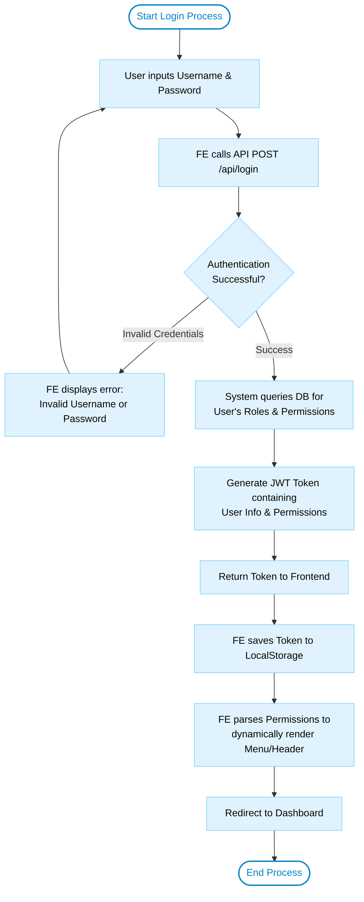
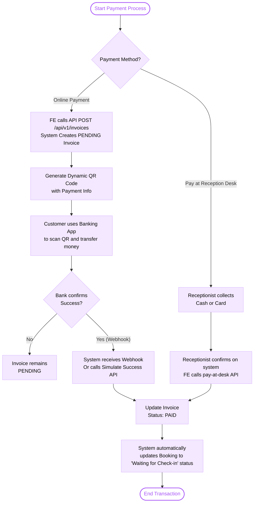
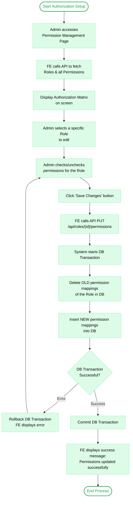

# Tài Liệu Đặc Tả Nghiệp Vụ & Luồng Xử Lý (Business Flow & Logic)

Tài liệu này tổng hợp chi tiết về **nghiệp vụ (Business Logic)** và **luồng xử lý (Flowchart)** của 4 module chính trong hệ thống quản lý khách sạn.

---

## 1. Nhóm Common: Xác thực, Phân quyền & Tài khoản
Nhóm này đóng vai trò là "lớp lá chắn" bảo mật cho toàn bộ hệ thống Khách sạn, sử dụng cơ chế **Stateless Authentication** dựa trên **JWT (JSON Web Token)** kết hợp với **Spring Security**.

### 1.1. Luồng Đăng nhập (User Login/Authen) & Render Menu Động
**Nghiệp vụ (Business Logic):**
- **Xác thực trạng thái**: Trước khi so sánh mật khẩu, hệ thống kiểm tra trạng thái tài khoản. Nếu trạng thái là `PENDING_VERIFICATION` (chưa xác thực OTP lúc đăng ký), hệ thống lập tức chặn lại và ném lỗi `401 Unauthorized`.
- **Mã hóa một chiều**: Mật khẩu không bao giờ được so sánh chuỗi thuần, mà phải thông qua thuật toán `BCrypt` (`passwordEncoder.matches`).
- **Gói quyền vào Token**: Khi đăng nhập thành công, hệ thống truy vấn luôn danh sách Quyền (Permissions) dựa trên Vai trò (Role). Tất cả thông tin này được mã hóa vào trong một chuỗi **JWT Access Token**.
- **Hiển thị Menu Động (Authorize/Header/Menu)**: Frontend giải mã JWT Token (hoặc đọc thông tin User đi kèm), lấy ra mảng permissions. Các Menu (như Quản lý nhân viên, Phân quyền) sử dụng Hook `hasPermission()` để quyết định hiển thị hay ẩn đi tùy theo quyền.
- **Security Filter**: Ở các API tiếp theo, `JwtAuthenticationFilter` ở backend sẽ chặn các request lại, giải mã Token, trích xuất quyền và nạp vào `SecurityContext` để cho phép/từ chối truy cập qua annotation `@PreAuthorize`.

**Sơ đồ khối (Flowchart):**

### 1.2. Luồng Quên / Đổi Mật Khẩu (Forgot / Change Password)
**Nghiệp vụ (Business Logic):**
- **Forgot Password**: Cho phép khôi phục tài khoản. Hệ thống sinh ra một `Reset Password Token` (mã ngẫu nhiên UUID) lưu vào DB kèm thời hạn sống (thường 15 phút). Một Email được gửi cho khách hàng chứa link đính kèm Token. Khách hàng click vào link, tạo mật khẩu mới. Hệ thống đối chiếu Token, hạn dùng, nếu hợp lệ sẽ đổi pass và xóa token cũ đi.
- **Change Password**: Dành cho người dùng đang hoạt động tự đổi pass. Hệ thống yêu cầu xác minh lại mật khẩu cũ qua việc match BCrypt, sau đó cập nhật mật khẩu mới, đồng thời ghi log hành động vào `AuditLog` để lưu vết hệ thống.

---

## 2. Nhóm Customer Management (Quản lý Khách hàng)

### 2.1. Add/Update/View Customer Detail & View List
**Nghiệp vụ (Business Logic):**
- **Quản lý tập trung**: Cho phép Lễ tân hoặc Quản lý tra cứu dữ liệu khách hàng nhanh chóng. Cần cấp các quyền: `CUSTOMER_VIEW, CUSTOMER_CREATE, CUSTOMER_UPDATE`.
- **Ràng buộc tính vẹn toàn (Data Integrity)**: Email, Số điện thoại và Số CCCD/Passport phải là **duy nhất (Unique)** trên toàn hệ thống để tránh việc 1 khách hàng tạo nhiều hồ sơ rác. Backend có bộ Validation chặt chẽ để trả về lỗi 400 nếu vi phạm.
- **Hai loại đối tượng Khách hàng**:
  - *Có tài khoản (Registered)*: Nếu khách tự đăng ký qua Web, bản ghi `Customer` sẽ liên kết 1-1 với bản ghi `User` thông qua khóa ngoại.
  - *Khách vãng lai (Guest)*: Do Lễ tân tự thêm vào hệ thống khi khách tới quầy. Bản ghi `Customer` này sẽ không có tài khoản đăng nhập (Khóa ngoại trỏ tới User bị Null).

---

## 3. Nhóm Billing & Payment Management (Thanh toán & Hóa đơn)

### 3.1. Invoice/Payment Detail & View Invoice/Payment List
**Nghiệp vụ (Business Logic):**
- **Tính bất biến của Hóa đơn**: Hóa đơn (`Invoice`) được hệ thống tự động sinh ra dựa trên vòng đời Đặt phòng (Booking), bao gồm: Tiền phòng, các Dịch vụ sử dụng thêm (minibar, giặt ủi...) và Thuế/Phụ phí. Lễ tân **không được phép xóa hoặc sửa trực tiếp** tổng tiền hóa đơn trong Database.
- **Quản lý các khoản thanh toán (Payment Detail)**: Khách hàng có thể trả nhiều lần (cọc trước, trả phần còn lại). Mỗi lần thanh toán sẽ ghi nhận 1 bản ghi `Payment Detail`.
- **Hỗ trợ thanh toán đa kênh**: Cung cấp tùy chọn trả tiền mặt/quẹt thẻ (Pay at Desk) hoặc thanh toán trực tuyến qua mã QR động (Bank Transfer).
- **Trigger Tự động (Auto-Update)**: Khi tổng các khoản thanh toán lớn hơn hoặc bằng (`>=`) số tiền hóa đơn, hệ thống sẽ tự động cập nhật Status Hóa đơn thành `PAID` (Đã thanh toán) và kích hoạt thay đổi Trạng thái của Booking tương ứng (ví dụ: Tự động đổi sang `Waiting for Check-in`).

**Sơ đồ khối (Flowchart):**

---

## 4. Nhóm Phân quyền Động (Dynamic Authorization)

### 4.1. View / Assign Permission
**Nghiệp vụ (Business Logic):**
- **Mô hình RBAC**: Áp dụng mô hình **Role-Based Access Control** mở rộng. Dữ liệu Vai trò (`roles`) và Quyền hạn (`permission`) được nối với nhau qua bảng trung gian `role_permissions` (Quan hệ Many-to-Many).
- **Tính năng cốt lõi**: Khác với phân quyền cứng (hard-code), tính năng này cho phép Quản trị viên (Admin) thay đổi quyền của bất kỳ Role nào (VD: cho phép Lễ tân được quyền Xóa Khách hàng) ngay trên giao diện UI mà không cần sửa code hay khởi động lại Server.
- **Yêu cầu ủy quyền nghiêm ngặt**: Chỉ những user sở hữu quyền tối cao `USER_AUTHORIZE` mới được phép gọi API thay đổi quyền.
- **Cơ chế cập nhật (Transaction)**: Khi Admin bấm "Lưu thay đổi" (gửi List các ID quyền mới), Backend sẽ mở DB Transaction:
  1. Chạy lệnh `DELETE` xóa toàn bộ mapping quyền cũ của Role đó.
  2. Chạy lệnh `INSERT` để nạp danh sách mapping quyền mới vào.
- **Độ trễ cập nhật Token**: Vì quyền của người dùng được nhúng cứng vào payload của JWT Token ngay từ lúc đăng nhập, do đó, nếu Admin đổi quyền của một Role, các user thuộc Role đó cần phải Đăng nhập lại (để Server sinh Token mới) thì bộ quyền mới mới có hiệu lực.

**Sơ đồ khối (Flowchart):**

