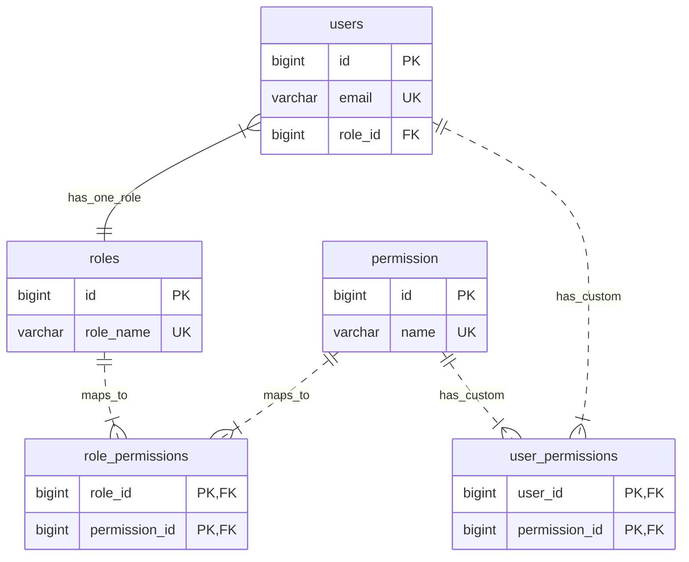

# Hướng dẫn chi tiết: Phân quyền động (Dynamic Authorization)

## 1. Tổng quan (Overview)
Tính năng phân quyền động (Dynamic Authorization) cho phép quản trị viên xem và gán các quyền (permissions) khác nhau cho từng vai trò (role) trực tiếp trên giao diện, thay vì phải sửa code hoặc can thiệp vào cơ sở dữ liệu.

*   **Frontend Component**: [RolePermissionManager.jsx](file:///d:/FPT/Ki5/SWP391/Hotel_Management_System/SWP391_Project/frontend/src/components/RolePermissionManager.jsx)
*   **Backend Controller**: [RoleController.java](file:///d:/FPT/Ki5/SWP391/Hotel_Management_System/SWP391_Project/src/main/java/com/hms/controller/auth/RoleController.java)
*   **Service**: [RoleServiceImpl.java](file:///d:/FPT/Ki5/SWP391/Hotel_Management_System/SWP391_Project/src/main/java/com/hms/service/auth/impl/RoleServiceImpl.java)
*   **Quyền yêu cầu**: `USER_AUTHORIZE`

---

## 2. Thiết kế Cơ sở Dữ liệu (Database Schema)
Hệ thống sử dụng mô hình phân quyền **RBAC (Role-Based Access Control)** mở rộng, cho phép quản lý cả quyền theo Vai trò (Role-level) và quyền tùy chỉnh theo từng Tài khoản (User-level).

### A. Các bảng cơ sở dữ liệu (Database Tables)
Hệ thống quản lý phân quyền qua 5 bảng chính trong Database:
1.  **`roles`**: Lưu trữ các vai trò trong hệ thống (ADMIN, MANAGER, RECEPTIONIST,...).
    *   Entity tương ứng: [Role.java](file:///d:/FPT/Ki5/SWP391/Hotel_Management_System/SWP391_Project/src/main/java/com/hms/entity/auth/Role.java)
2.  **`permission`**: Lưu danh sách tất cả các quyền hạn chi tiết (USER_VIEW, ROOM_CREATE,...).
    *   Entity tương ứng: [Permission.java](file:///d:/FPT/Ki5/SWP391/Hotel_Management_System/SWP391_Project/src/main/java/com/hms/entity/auth/Permission.java)
3.  **`role_permissions`**: Bảng trung gian thể hiện quan hệ Many-to-Many giữa `roles` và `permission`. Khi Admin chỉnh sửa phân quyền trên UI, dữ liệu bảng này sẽ thay đổi.
4.  **`users`**: Lưu trữ thông tin tài khoản nhân viên và khách hàng. Liên kết Many-to-One với `roles` qua khóa ngoại `role_id`.
    *   Entity tương ứng: [User.java](file:///d:/FPT/Ki5/SWP391/Hotel_Management_System/SWP391_Project/src/main/java/com/hms/entity/auth/User.java)
5.  **`user_permissions`**: Bảng trung gian Many-to-Many giữa `users` và `permission`. Dùng cho tính năng **Quyền tùy biến (Custom Permissions)**: cho phép gán hoặc thu hồi một số quyền cụ thể cho một tài khoản duy nhất mà không ảnh hưởng tới các tài khoản khác cùng vai trò.

### B. Sơ đồ mối quan hệ thực thể (ERD Diagram)


---

## 3. Phân tích Nghiệp vụ Vai trò (Business Role Matrix)
Mỗi vai trò (Role) trong hệ thống tương ứng với các nhiệm vụ thực tế của nhân viên trong khách sạn:

1.  **ADMIN (Quản trị viên hệ thống)**
    *   *Nhiệm vụ:* Quản lý cấu hình, cấp tài khoản cho nhân viên, quản lý quyền hạn của các Role.
    *   *Quyền hạn cốt lõi:* `USER_*`, `AUDIT_LOG_VIEW`, `DASHBOARD_VIEW`.
2.  **MANAGER (Quản lý khách sạn)**
    *   *Nhiệm vụ:* Giám sát và điều hành toàn bộ hoạt động kinh doanh, nhân sự, buồng phòng, sửa chữa, xem doanh thu.
    *   *Quyền hạn cốt lõi:* Có hầu hết các quyền của hệ thống trừ phân quyền Admin (`USER_AUTHORIZE`).
3.  **RECEPTIONIST (Lễ tân)**
    *   *Nhiệm vụ:* Tiếp đón khách, đặt phòng, làm thủ tục check-in, check-out, lập hóa đơn, tiếp nhận ý kiến phản hồi của khách hàng.
    *   *Quyền hạn cốt lõi:* `BOOKING_*` (trừ DELETE), `CHECKIN_VIEW`, `CHECKOUT_VIEW`, `CUSTOMER_*` (trừ DELETE), `INVOICE_VIEW`, `FEEDBACK_VIEW/UPDATE`.
4.  **HOUSEKEEPER (Nhân viên buồng phòng)**
    *   *Nhiệm vụ:* Dọn dẹp phòng, báo cáo tình trạng buồng phòng, thông báo thiết bị hỏng cần sửa.
    *   *Quyền hạn cốt lõi:* `HOUSEKEEPING_VIEW/CREATE/UPDATE`, `ROOM_VIEW`, `EQUIPMENT_VIEW`, `MAINTENANCE_CREATE`.
5.  **MAINTENANCE (Nhân viên bảo trì)**
    *   *Nhiệm vụ:* Nhận thông tin và sửa chữa các thiết bị hư hỏng của khách sạn.
    *   *Quyền hạn cốt lõi:* `MAINTENANCE_*` (trừ DELETE), `EQUIPMENT_*` (trừ DELETE), `ROOM_VIEW`.
6.  **CUSTOMER (Khách hàng)**
    *   *Nhiệm vụ:* Đăng nhập đặt phòng online, gửi đánh giá và nhận xét về khách sạn.
    *   *Quyền hạn cốt lõi:* `BOOKING_VIEW_OWN`, `BOOKING_CREATE`, `FEEDBACK_CREATE`, `FEEDBACK_VIEW_OWN/UPDATE_OWN/DELETE_OWN`.

---

## 4. Luồng hoạt động (Workflow)

### A. Luồng xem phân quyền (View Permissions)
1. **Frontend**: Component [RolePermissionManager.jsx](file:///d:/FPT/Ki5/SWP391/Hotel_Management_System/SWP391_Project/frontend/src/components/RolePermissionManager.jsx) (trong hàm `loadData` tại [dòng 87](file:///d:/FPT/Ki5/SWP391/Hotel_Management_System/SWP391_Project/frontend/src/components/RolePermissionManager.jsx#L87-L107)) gọi 2 API song song:
   - Lấy danh sách Roles: `GET /api/v1/roles`
   - Lấy danh sách Permissions: `GET /api/v1/permissions`
2. **Backend**:
   - `RoleController` và `PermissionController` trả về dữ liệu tương ứng.
   - Mỗi `Role` sẽ có sẵn một mảng `permissions` chứa các quyền hiện tại của vai trò đó.
3. **Hiển thị**: 
   - Danh sách Roles hiển thị cột bên trái.
   - Các quyền được nhóm lại theo `PERMISSION_GROUPS` (định nghĩa tại [dòng 7](file:///d:/FPT/Ki5/SWP391/Hotel_Management_System/SWP391_Project/frontend/src/components/RolePermissionManager.jsx#L7-L21)) hiển thị ở màn hình chính.
   - Khi chọn một Role, Frontend kiểm tra quyền nào có trong mảng `permissions` của Role đó để đánh dấu "Checked".

### B. Luồng gán quyền (Assign Permissions)
1. **Người dùng thao tác**: Check/Uncheck các quyền trên giao diện và nhấn nút **Lưu cấu hình**.
2. **Frontend**: Tại hàm `handleSave` ([dòng 150](file:///d:/FPT/Ki5/SWP391/Hotel_Management_System/SWP391_Project/frontend/src/components/RolePermissionManager.jsx#L150-L165)), Frontend gửi request `PUT /api/v1/roles/{roleId}/permissions` với payload là mảng `permissionIds` (ví dụ: `[1, 2, 5, 8]`).
3. **Backend (`RoleController`)**:
   - Nhận request tại hàm `assignPermissionsToRole` ([dòng 151](file:///d:/FPT/Ki5/SWP391/Hotel_Management_System/SWP391_Project/src/main/java/com/hms/controller/auth/RoleController.java#L151-L164)).
   - Kiểm tra xem user hiện tại có quyền `USER_AUTHORIZE` không (thông qua `@PreAuthorize`).
4. **Backend (`RoleServiceImpl`)**:
   - Tại hàm `assignPermissionsToRole` ([dòng 154](file:///d:/FPT/Ki5/SWP391/Hotel_Management_System/SWP391_Project/src/main/java/com/hms/service/auth/impl/RoleServiceImpl.java#L154-L166)): Tìm `Role` trong database theo `roleId`.
   - Tìm danh sách `Permission` theo mảng `permissionIds` truyền lên.
   - Gọi `role.setPermissions(new HashSet<>(permissions))` để cập nhật mối quan hệ.
   - Lưu `Role` xuống database (`roleRepository.save(role)`).
5. **Cập nhật UI**: Frontend nhận response thành công, cập nhật lại state `roles` cục bộ và hiển thị thông báo thành công.

---

## 5. Cấu trúc Code và Cách chỉnh sửa

### A. Thêm mới một nhóm quyền (Permission Group) trên Frontend
Nếu bạn thêm một thực thể mới (ví dụ: `SERVICE`), bạn cần cập nhật Frontend để nhóm quyền này hiển thị đẹp mắt.
**File**: [RolePermissionManager.jsx](file:///d:/FPT/Ki5/SWP391/Hotel_Management_System/SWP391_Project/frontend/src/components/RolePermissionManager.jsx)

1. Thêm vào biến `PERMISSION_GROUPS` ([dòng 7](file:///d:/FPT/Ki5/SWP391/Hotel_Management_System/SWP391_Project/frontend/src/components/RolePermissionManager.jsx#L7-L21)):
```javascript
const PERMISSION_GROUPS = {
  // ... các nhóm cũ
  SERVICE: { vi: 'Quản lý Dịch vụ', en: 'Service Management' }
};
```
2. Thêm mô tả cho từng quyền vào `PERMISSION_DESCRIPTIONS` ([dòng 23](file:///d:/FPT/Ki5/SWP391/Hotel_Management_System/SWP391_Project/frontend/src/components/RolePermissionManager.jsx#L23-L70)):
```javascript
const PERMISSION_DESCRIPTIONS = {
  // ...
  SERVICE_VIEW: { vi: 'Xem dịch vụ', en: 'View services' },
  SERVICE_CREATE: { vi: 'Tạo dịch vụ', en: 'Create services' },
  // ...
};
```

### B. Khởi tạo quyền mới dưới Database (Backend)
Để hệ thống tự động nhận diện quyền mới khi khởi động, bạn cấu hình trong file khởi tạo dữ liệu.
**File**: [PermissionDataInitializer.java](file:///d:/FPT/Ki5/SWP391/Hotel_Management_System/SWP391_Project/src/main/java/com/hms/common/config/PermissionDataInitializer.java)

1. Thêm tên quyền mới vào phương thức cấp quyền tương ứng (ví dụ: `assignPermissionsToAdmin` tại [dòng 113](file:///d:/FPT/Ki5/SWP391/Hotel_Management_System/SWP391_Project/src/main/java/com/hms/common/config/PermissionDataInitializer.java#L113-L122)):
```java
private void assignPermissionsToAdmin() {
    List<String> requiredPermissions = Arrays.asList(
        // ... các quyền cũ
        "SERVICE_VIEW", "SERVICE_CREATE", "SERVICE_UPDATE", "SERVICE_DELETE"
    );
    // ...
}
```
Khi Spring Boot chạy, nó sẽ tự động `INSERT` các quyền chưa tồn tại vào bảng `permissions`.

### C. Sử dụng quyền để bảo vệ API (Backend)
Sau khi quyền đã được sinh ra, bạn dùng nó để chặn các API tương ứng bằng Annotaion `@PreAuthorize`.

```java
@RestController
@RequestMapping("/api/v1/services")
public class ServiceController {

    @GetMapping
    @PreAuthorize("hasAuthority('SERVICE_VIEW')") // Yêu cầu quyền xem
    public ResponseEntity<?> getAllServices() { ... }

    @PostMapping
    @PreAuthorize("hasAuthority('SERVICE_CREATE')") // Yêu cầu quyền tạo
    public ResponseEntity<?> createService(...) { ... }
}
```

### D. Sử dụng quyền để ẩn/hiện thành phần UI (Frontend)
Bạn có thể dùng custom hook `usePermission` để kiểm tra quyền và ẩn các nút bấm không được phép trên giao diện.

```javascript
import { usePermission } from '../hooks/usePermission';

export default function ServiceManager() {
  const { hasPermission } = usePermission();

  return (
    <div>
      {/* Chỉ hiển thị nút Thêm mới nếu có quyền SERVICE_CREATE */}
      {hasPermission('SERVICE_CREATE') && (
        <button>Thêm Dịch vụ</button>
      )}
    </div>
  );
}
```

---

## 6. Các điểm lưu ý quan trọng (Gotchas)
> [!WARNING]
> - **Tự động cấp quyền Admin**: Vai trò `ADMIN` thường nên được gán đầy đủ quyền. Trong [PermissionDataInitializer.java](file:///d:/FPT/Ki5/SWP391/Hotel_Management_System/SWP391_Project/src/main/java/com/hms/common/config/PermissionDataInitializer.java), hàm `syncRolePermissions("ADMIN", ...)` đảm bảo Admin luôn có các quyền quan trọng, nếu thêm quyền mới, nhớ bổ sung vào danh sách này để Admin không bị thiếu quyền.
> - **Cập nhật dữ liệu vào Token**: Người dùng hiện tại nếu bị thay đổi quyền sẽ cần **đăng xuất và đăng nhập lại** (để lấy JWT Token mới) thì các quyền mới được gán mới có tác dụng (vì danh sách quyền được mã hóa cứng bên trong JWT Token).
> - **Cơ chế hoạt động của `RolePermissionManager`**: Ở frontend, `groupedPermissions` sẽ duyệt qua danh sách permissions và tự động phân nhóm bằng cách cắt chuỗi theo dấu `_` (ví dụ `SERVICE_VIEW` sẽ cắt ra tiền tố `SERVICE`). Nếu tiền tố này nằm trong mảng `PERMISSION_GROUPS`, nó sẽ gom nhóm tương ứng.
